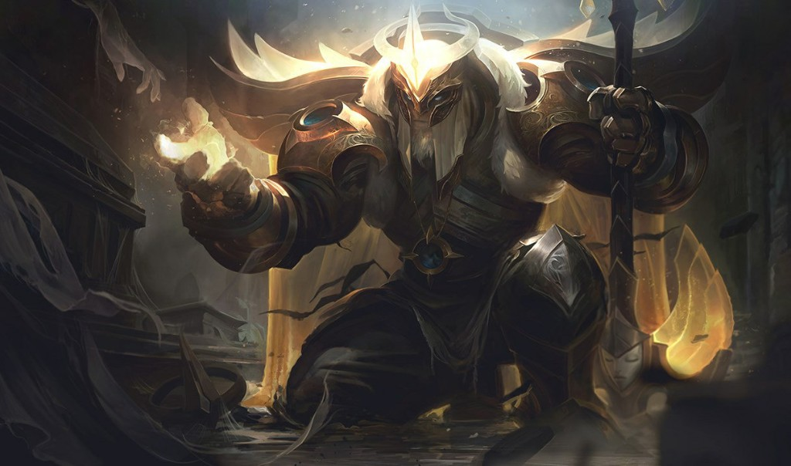

# Yorick Supply of Souls

  

> *"A man is very small when he is on his knees."*  
> An MT5 Expert Advisor named after Yorick - a shepherd of gold who waits for souls to return to marked graves.

## What it is

**Yorick Supply of Souls** is a MetaTrader 5 expert that scans for high-quality return setups on gold, sizes each march from balance, and marks protection beyond the grave. Defaults ship **pre-tuned** for a patient **XAUUSD D1** stand.

This is the mirror companion to [Braum Following Trend](https://github.com/randiapriliyadiR/braum-following-trend): Braum shines on **BTCUSD H1** with a small balance; Yorick's edge showed strongest on **gold daily**, not crypto.

## Best verified stand (defaults)

| Setting | Value |
|---|---|
| Symbol | XAUUSD |
| Timeframe | D1 |
| Soul budget | 2% of balance per trade |
| Range | 2021.01.01 -> 2026.08.26 |
| Model | 1 minute OHLC |
| Broker sample | Exness MT5 |

### Large balance - $100,000 (shipped default)

| Metric | Result |
|---|---:|
| Net profit | **+$23,815.80** |
| Ending balance | **~$123,816** |
| Profit factor | **1.39** |
| Total trades | 49 |
| Win rate | 44.9% |
| Equity drawdown max | **17.21%** |
| Balance drawdown max | 9.94% |

On a **$100k** start, the tuned shepherd returned roughly **+24%** net over the sample with under **18%** equity drawdown - a calm, sparse cadence (~10 fills per year).

### Small balance - $200 (same D1 defaults)

| Metric | Result |
|---|---:|
| Net profit | -$3.66 |
| Ending balance | ~$196 |
| Profit factor | 0.00 |
| Total trades | **1** |
| Equity drawdown max | 3.24% |

With **$200** on D1, lot sizes are tiny and setups are **rare** - only one fill appeared in the full window. Unlike Braum's busy H1 crypto march, Yorick's shipped stand is built for **patient gold capital**, not micro-account compounding on daily bars.

### Why these defaults

A coarse-then-refine search on XAUUSD D1 (deposit $100k) beat the earlier strict factory preset by a wide margin:

| Preset | Net | Profit factor | Trades | Equity DD |
|---|---:|---:|---:|---:|
| Older factory-style | -$1,759 | 0.56 | 3 | 4.2% |
| **Shipped tuned (default)** | **+$23,816** | **1.39** | 49 | 17.2% |

### Gold vs crypto (inverse of Braum)

Same tuned soul inputs, **$200** deposit, 2021.01.01 -> 2026.08.26:

| Market / TF | Net | Profit factor | Trades | Notes |
|---|---:|---:|---:|---|
| **XAUUSD D1 (shipped)** | -$3.66 | 0.00 | 1 | Sparse fills on tiny balance |
| **XAUUSD D1 ($100k)** | **+$23,816** | **1.39** | 49 | **Home stand** |
| XAUUSD M5 ($200) | +$833,623* | 1.10 | 7,126 | Noisy; deep DD ~33% |
| BTCUSD M15 | -$56 | 0.97 | 1,379 | Unfavorable |
| BTCUSD H1 | -$94 | 0.74 | 201 | Unfavorable |
| BTCUSD H4 | -$55 | 0.28 | 30 | Unfavorable |

*M5 figures reflect thousands of micro-lot fills and compounding - thinner edge per soul than D1.

**Takeaway:** Braum = BTC small account. **Yorick = XAUUSD, especially D1 with meaningful balance.**

## Install (MT5)

1. Copy this folder under `MQL5/Experts/Yorick Supply of Souls/`.
2. Copy `Indicators/*.mq5` into your terminal `MQL5/Indicators/`, then compile the EA and indicators in MetaEditor.
3. Attach **Yorick Supply of Souls** to a chart (XAUUSD D1 recommended).
4. Leave **Flock** / **Souls** inputs at defaults unless you know what you are changing.
5. Enable Algo Trading.

## Inputs (friendly names)

| Group | What you touch |
|---|---|
| Flock | Grave market filter, shepherd timeframe, soul budget %, identity stamp, slippage, spread fog |
| Souls | Breath period, surge length/body, structure bars, scan depth, gates, grave buffer |

Exact recipes stay in the mist - the published defaults are already the tuned shepherd.

## Disclaimer

Past backtests are not a promise of future profit. Gold can gap; drawdowns above 17% occurred in sample on large balance. Use money you can afford to risk. This is research software, not financial advice.

## Author

**Randi Apriliyadi**  
Repository: [github.com/randiapriliyadiR/yorick-supply-souls](https://github.com/randiapriliyadiR/yorick-supply-souls)

Art reference: Arclight Yorick (League of Legends) - used here as naming inspiration for a patient gold shepherd.
